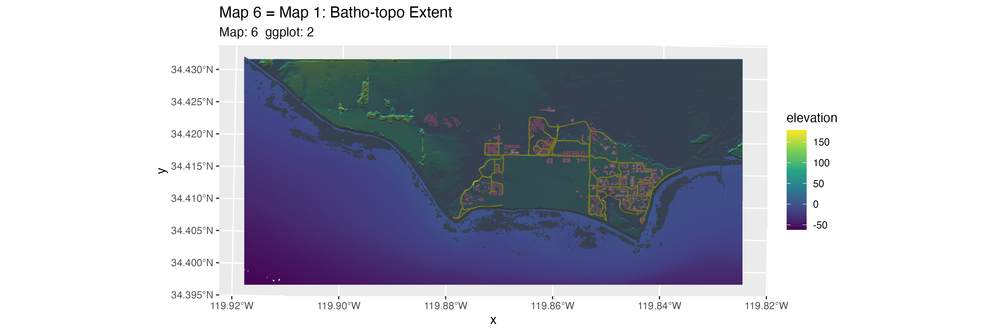
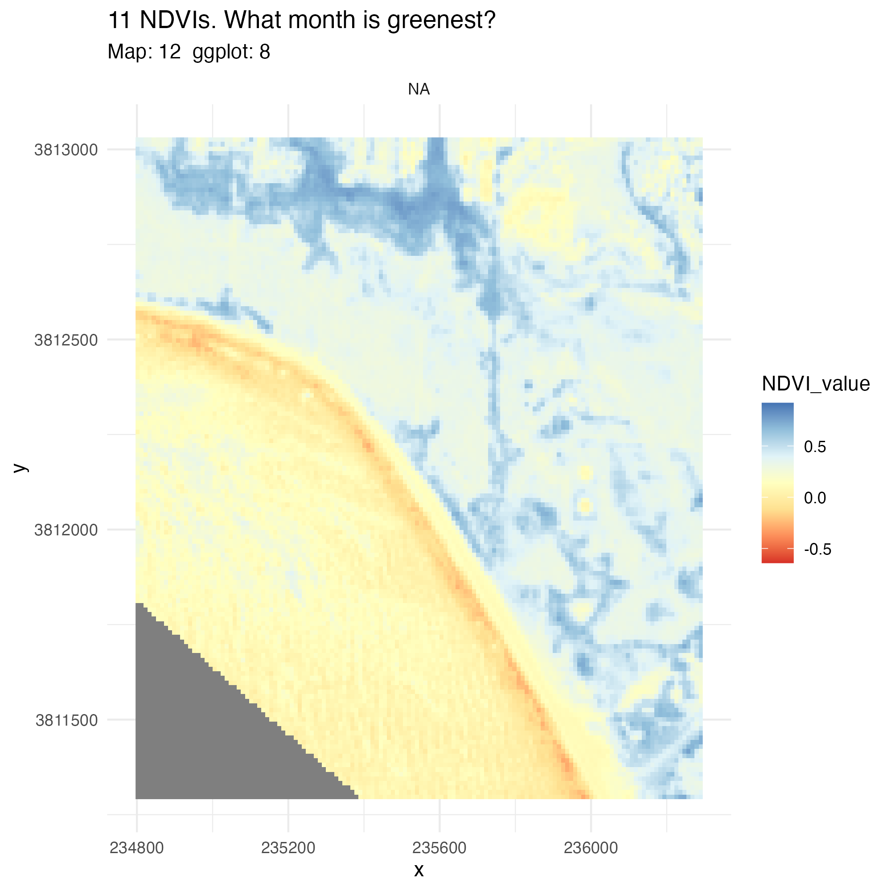

# ucsb-ratlas

### A geospatial R example atlas of the UCSB campus

A repo that uses local UCSB examples applied to all of the steps of the
Carpentries' Intro to Raster and Vector Data workshop.

Scripts run parallel to the episodes (ep_01.r ep_02.r ... ep_13.r) and
create maps 'suitable for publication' (map01.r, map02.r, ... map12.r)
as laid out in Maps 1 thru 12 below.

The goals are to produce nice atlas pages of campus that use all of the
techniques covered in the Intro to GeoSpatial R Carpentry lesson.

We have created a [Data Dictionary](datadictionary.md) to help us keep
track of object names and files.

## Getting Started

1: Clone this repo.

2: Run `scripts/data_prep_new.r` This script downloads a folder from our
Carpentry Google drive into a `downloaded_data` directory), and unzips
it into `source_data`

3: Now you can run `run_every_map.r` and `run_every_episode.r` (in that
order) to produce output from these data sources. Any data that an
episode writes is placed in `output_data` and any formatted maps are
placed in `images`. Both are .gitignored. `final_output` has .png files
used in the readme.

4: Script away! Feel free to tackle issues, express issues, or just do
work if you see work that needs to be done.

5: Episode scripts produce a number of maps, but not particularly well
formatted. They are formated as in the Lesson, with the addition of
ggtitles to keep track of where they are generated.

All outputs from map scripts should have a 3 tall x 4 wide aspect ratio,
except where noted.

[Check out our progess](progress.md "August, 2025 outputs.")

### Map 1. A wide view of campus with:

-   Extent should be the same as #3 inset of map 7.
-   NCOS – for now the new lagoon habitat shapefile
-   Water
-   Bathymetry and elevation in one layer
    -   hillshade
-   bike paths
-   buildings – for context
-   vernal pools:
    -   vector data to be create via analysis from DEMs
    -   this will come later

Something like this: 

### Map 2. A stylized thematic map with trees, water, and bikeways

-   ArcGIS Online: Water:
-   NCOS upper lagoon shapefile of bathymetric topo lines or polygons is
    it this [bird habitat
    file?](https://drive.google.com/file/d/1ssytmTbpC1rpT5b-h8AxtvSgNrsGQVNY/view?usp=drive_link)
    – yes bird habitats
-   Shows as dark mode (and I like it)

Something like this: 

### Map 7 An atlas page layout with 4 insets:

Map 6 is the top tryptic = Maps 3-4-5 zoom-in.

#### Map 3. California Overview
Portrait 3x4 Western US
Does it want water?
- remove tic marks

#### Map 4. The Bite of California
Portrait 3x4 
- Needs to be further zoomed in?
- populated places needs to be better visualized
- needs water!
- shows as dark mode and I don't like it
- remove degrees

#### Map 5. Extended Campus
(issue #14) 
Landscape 4x3 
\* extended campus will have maptiles background? \* 
- shows as dark mode and I don't like it

### Map 6. The tryptic

Wide Landscape 9x16ish? 
\* A stripped down version of map #1, symbolized
to match the look of 3-4-5 

## Map 7: The Layout

#### Map 7 sketch:

We used to have a jpg of the whiteboard here.

## Map 8 RS Imagery

For starters, this will be one 8-band image visualized several different
ways. Which is an expansion of episode 5. Something like this: 

## 9 Analysis: Find landscape depressions on Campus DEM

ie: identify vernal pools. Find elevations \> sea level that are
surrounded by nearby neighbors that are higher.

## 10 Analysis: Find bike paths that cross water?

## Map 11: Look at a Dibblee

## Map 12 / Episode 12: 12 months of NDVI Raster Stack

[UCSB Carpentry](https://ucsbcarpentry.github.io)

[Original lesson -- Introduction to Geospatial Raster and Vector Data
with R](https://datacarpentry.org/r-raster-vector-geospatial/)
