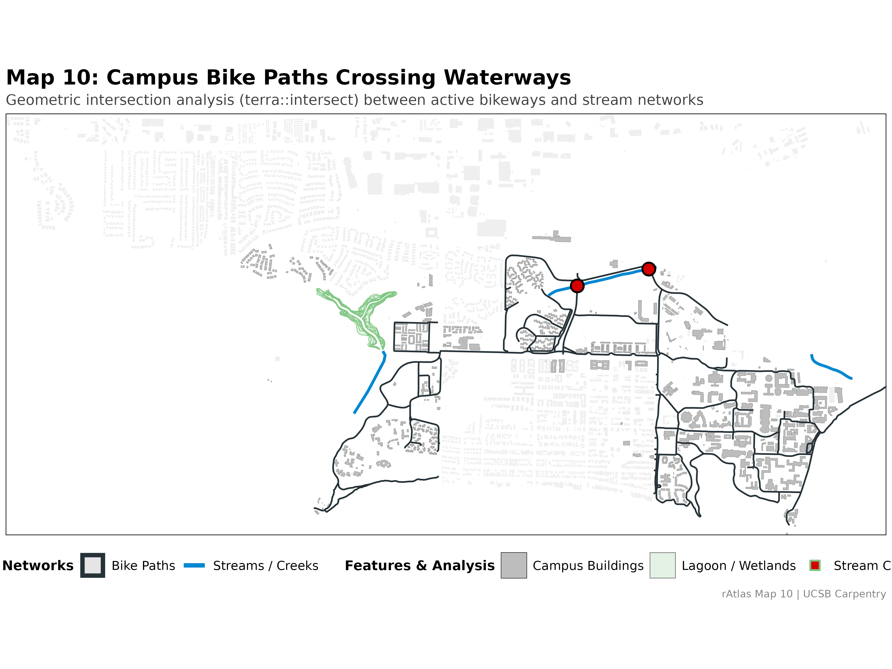
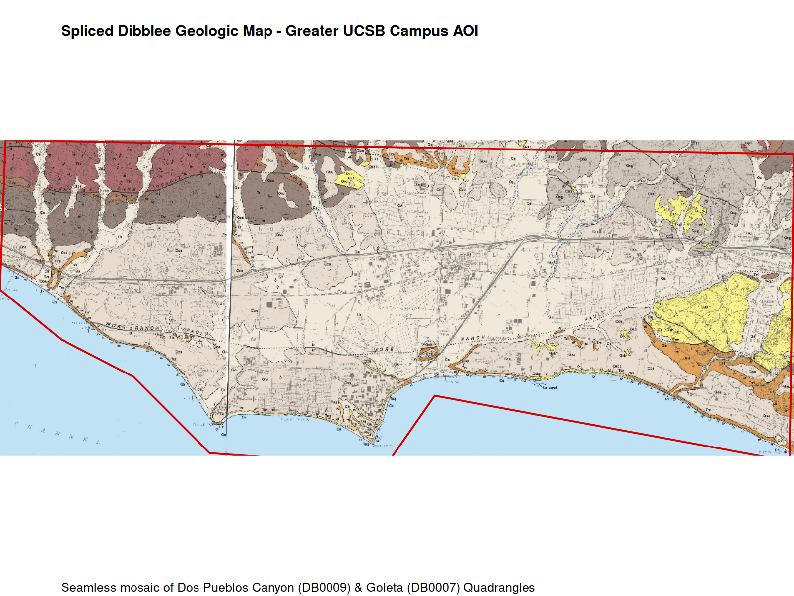
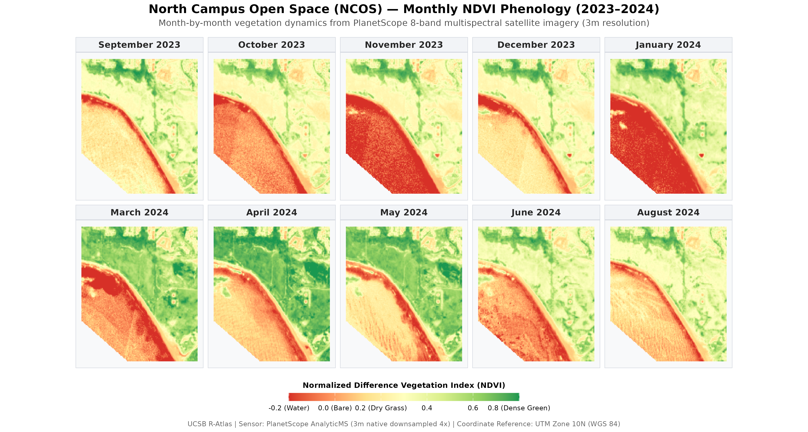

The atlas consists of 12 planned plates and analytical workflows covering raster processing, vector overlays, projection conversions, multi-band remote sensing, and composite cartographic layouts.

---

## Plates Index

| Plate | Title | Key Geospatial Concepts & Data Layers | Status |
|:---:|---|---|:---:|
| [**Map 1**](map_01.qmd) | Campus Overview | Topo-bathymetric raster merging, hillshade, bikeways, campus & Isla Vista buildings | Complete |
| [**Map 2**](map_02.qmd) | Thematic Trees & Water | Classified tree inventory by type, stream networks, prominent legend, clean axes | Complete |
| [**Map 3**](map_03.qmd) | Western US Locator | Continental elevation model, whole degree graticule, populated places layer | Complete |
| [**Map 4**](map_04.qmd) | The Bight of California | Sub-regional Southern California Bight, ocean hillshade, campus locator box | Complete |
| [**Map 5**](map_05.qmd) | Extended Campus | Greater campus DEM, batho-topo, hillshade, clean legendless presentation | Complete |
| [**Map 6**](map_06.qmd) | UCSB & Environs | Wide base map linking regional geometry to campus boundaries | Complete |
| [**Map 7**](map_07.qmd) | Atlas Page Layout | Multi-panel layout combining Maps 3, 4, 5 & 6 using `magick` | Complete |
| [**Map 8**](map_08.qmd) | Satellite Remote Sensing | PlanetScope 4-band / 8-band multispectral seasonal imagery | Complete |
| [**Map 9**](map_09.qmd) | Vernal Pools (DEM) | Landscape depression analysis using elevation neighbors | In Design |
| [**Map 10**](map_10.qmd) | Bike Paths & Creeks | Vector intersection analysis (`terra::intersect`) of trails and waterways | Complete |
| [**Map 10.5**](map_10_5.qmd) | Missing NCOS Trail | Data provenance analysis of post-2018 NCOS trail & bridge omission | Complete |
| [**Map 11**](map_11.qmd) | Spliced Dibblee Geology | Splicing adjacent sheets (Dos Pueblos Canyon & Goleta) across the campus AOI | Complete |
| [**Map 12**](map_12.qmd) | 12-Month NDVI Stack | Multi-temporal raster stack, NDVI calculation, vegetation phenology curve | Complete |

---

## Featured Plates

:::: {.grid}

::: {.g-col-12 .g-col-md-6}
#### [Map 1: Campus Overview](map_01.qmd)

Elevation, bathymetry, hillshade, and campus infrastructure.
:::

::: {.g-col-12 .g-col-md-6}
#### [Map 2: Trees & Water](map_02.qmd)

Stylized tree species and heights along coastal slough waters.
:::

::: {.g-col-12 .g-col-md-6}
#### [Map 7: Composite Atlas Plate](map_07.qmd)

4-inset layout showcasing progressive geographic scale.
:::

::: {.g-col-12 .g-col-md-6}
#### [Map 10: Paths & Creeks](map_10.qmd)

Vector intersection analysis mapping bike path stream crossings.
:::

::: {.g-col-12 .g-col-md-6}
#### [Map 10.5: Missing NCOS Trail](map_10_5.qmd)

Investigating temporal blind spots in campus bikeway data.
:::

::: {.g-col-12 .g-col-md-6}
#### [Map 11: Dibblee Geology](map_11.qmd)

Rectified and cropped historic geologic quadrangle map.
:::

::: {.g-col-12 .g-col-md-6}
#### [Map 12: NDVI Phenology Stack](map_12.qmd)

Annual vegetation index dynamics from satellite time series.
:::

::::
