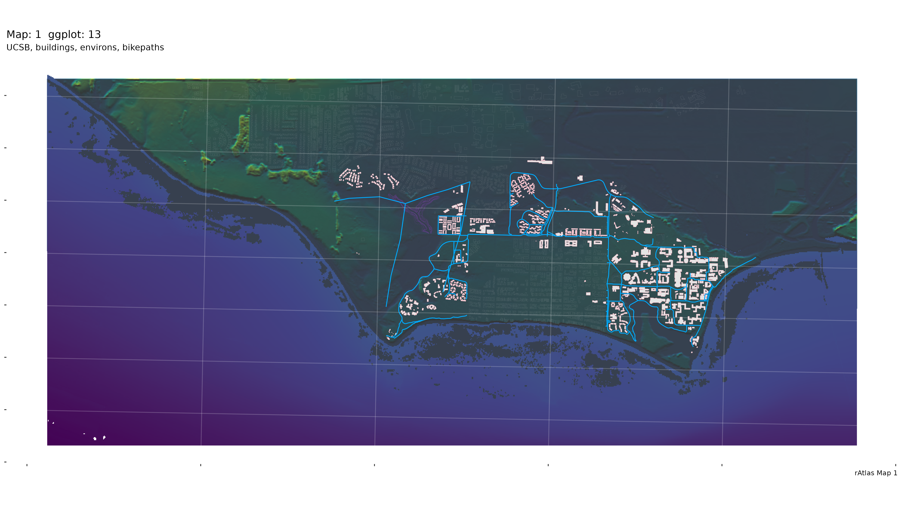
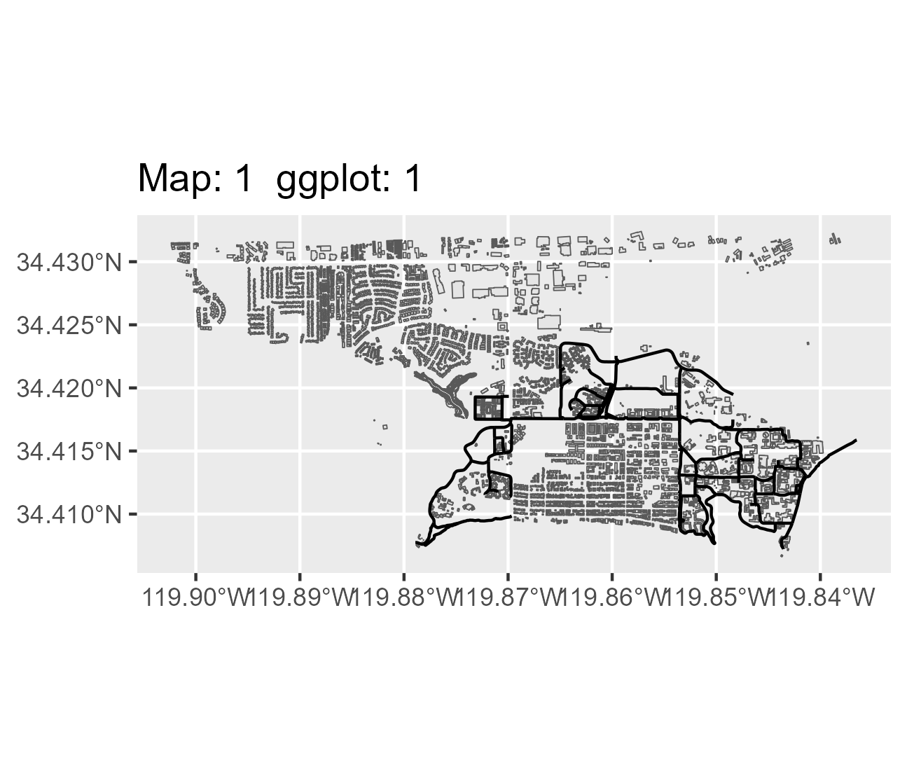
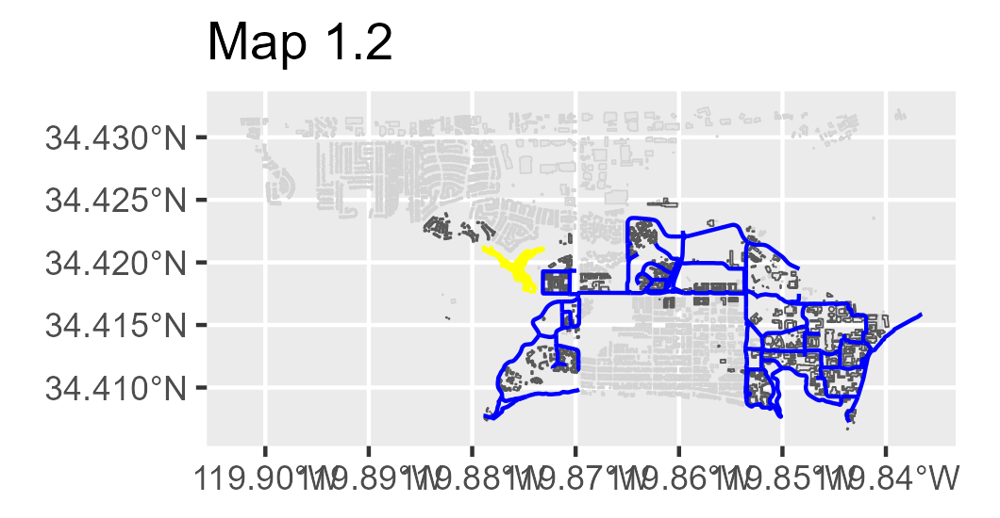
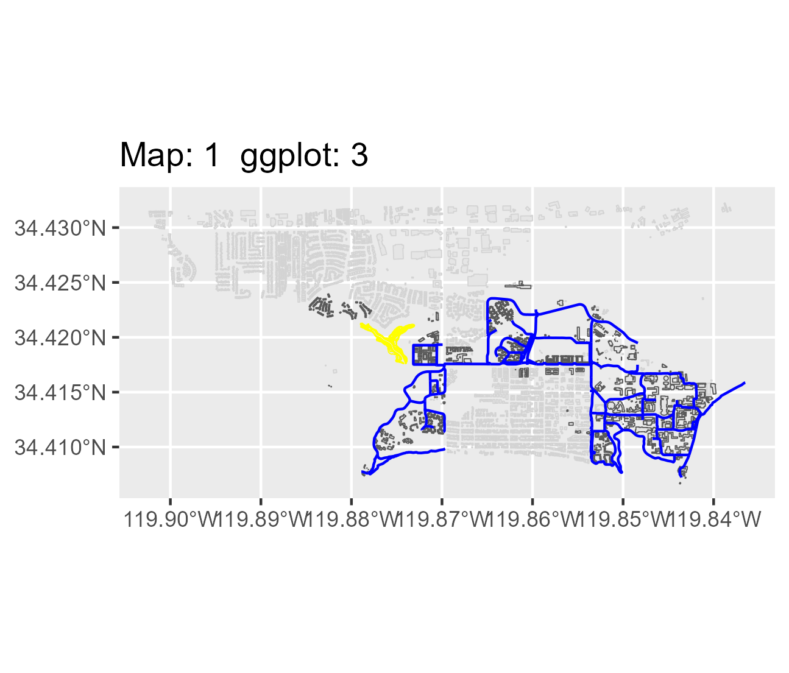
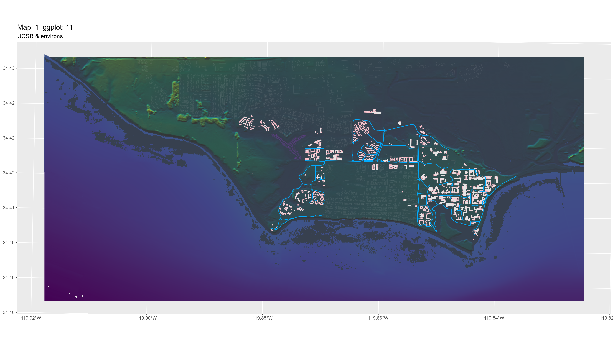

## Rendered Map Plate

{fig-alt="Map 1 Campus Overview" width="100%"}

---

## Technical Summary

* **Objective:** Produce a broad overview plate of the UCSB campus combining elevation, ocean bathymetry, hillshading, bike path networks, and building footprints.
* **Key Packages:** `terra`, `sf`, `tidyverse`, `scales`
* **Data Sources:**
  * Campus DEM raster (`source_data/campus_DEM.tif`)
  * Coastal bathymetry raster (`source_data/SB_bath.tif` / `HenleyGateEllwoodBeach.tif`)
  * Campus hillshade (`source_data/campus_hillshade.tif`)
  * Campus buildings footprint shapefile (`source_data/campus_buildings/Campus_Buildings.shp`)
  * Isla Vista building footprints (`source_data/iv_buildings/iv_buildings/CA_Structures_ExportFeatures.shp`)
  * Bike path centerlines (`source_data/icm_bikes/bike_paths/bikelanescollapsedv8.shp`)
  * Modern NCOS multi-use trails (`source_data/ncos_trails/ncos_multiuse_trails.geojson`)
  * Lagoon & shorebird foraging habitat (`source_data/NCOS_Shorebird_Foraging_Habitat/`)
* **Aspect Ratio:** 16 inches wide x 9 inches tall (`16x9`).

---

## Step-by-Step Cartographic Workflow & Intermediate Outputs

The generation script `scripts/map_01.r` iteratively layers vector features, resolves coordinate system mismatches, harmonizes disparate raster extents, and blends translucent hillshades. Below is the step-by-step breakdown:

### Step 1: Initial Vector Layer Ingestion & Overlay Test

The script begins by loading the infrastructure vector layers (`st_read`) for campus buildings, Isla Vista structures, bike lanes, and shorebird foraging habitats. An initial unstyled `ggplot` checks geometry alignment.

```r
# Initial vector load and plot check
buildings <- st_read("source_data/campus_buildings/Campus_Buildings.shp")
iv_buildings <- st_read("source_data/iv_buildings/iv_buildings/CA_Structures_ExportFeatures.shp")
bikeways <- st_read("source_data/icm_bikes/bike_paths/bikelanescollapsedv8.shp")
habitat <- st_read("source_data/NCOS_Shorebird_Foraging_Habitat/NCOS_Shorebird_Foraging_Habitat.shp")
ncos_trails <- st_read("source_data/ncos_trails/ncos_multiuse_trails.geojson")

ggplot() +
  geom_sf(data=habitat) +
  geom_sf(data=buildings) +
  geom_sf(data=iv_buildings) +
  geom_sf(data=bikeways) +
  geom_sf(data=ncos_trails) +
  coord_sf()
```

{fig-alt="Intermediate Output 1.1" width="80%"}

### Step 2: Applying Atlas Minimalist Theme & Color Differentiation

To eliminate clutter, a clean custom theme (`my_theme`) strips background fills and coordinate tick labels, leaving a faint white 20% graticule. Isla Vista buildings are pushed into a neutral gray hierarchy to keep UCSB campus buildings and bikeways prominent.

```r
# Applying theme and color hierarchy
ggplot() +
  geom_sf(data=habitat, color="yellow") +
  geom_sf(data=iv_buildings, color="light gray") +
  geom_sf(data=buildings) +
  geom_sf(data=bikeways, color="blue") +
  geom_sf(data=ncos_trails, color="blue") +
  my_theme +
  coord_sf()
```

::: {.grid}
::: {.g-col-12 .g-col-md-6}
{fig-alt="Intermediate Output 1.2" width="100%"}
:::
::: {.g-col-12 .g-col-md-6}
{fig-alt="Intermediate Output 1.2 Styled" width="100%"}
:::
:::

### Step 3: Reprojecting Bathymetry & Merging Topo-Bathymetric Rasters

The onshore digital elevation model (`campus_DEM.tif`, EPSG:2874) and offshore bathymetry (`SB_bath.tif`) have differing coordinate reference systems, resolutions, and extents. 

1. `project(campus_bath, crs(campus_DEM))` aligns coordinate systems.
2. `crop(campus_bath, campus_DEM)` restricts offshore bounds.
3. `resample()` standardizes cell resolutions to 20 feet.
4. `merge()` produces a single composite `campus_bathotopo.tif` surface.
5. All vector layers are reprojected using `st_transform(..., crs(campus_DEM))` to match the raster grid.

```r
# Aligning bathymetry and elevation
campus_projection <- crs(campus_DEM)
campus_bath <- project(campus_bath, campus_projection)
campus_bath <- crop(campus_bath, campus_DEM)

# Reproject vectors to match DEM CRS
buildings <- st_transform(buildings, campus_projection)
iv_buildings <- st_transform(iv_buildings, campus_projection)
bikeways <- st_transform(bikeways, campus_projection)
habitat <- st_transform(habitat, campus_projection)
ncos_trails <- st_transform(ncos_trails, campus_projection)
```

### Step 4: Alpha-Blended Hillshading & Final Composition

The final graphic introduces the multidirectional hillshade raster (`campus_hillshade.tif`). Using `geom_raster(aes(alpha = campus_hillshade))`, terrain relief is blended directly over the continuous viridis elevation/bathymetry gradient without washing out bikeway vectors or building footprints.

```r
# Final composition with hillshade alpha blending
final_ggplot <- ggplot() +
  geom_raster(data = campus_DEM_df, aes(x=x, y=y, fill = elevation)) +
  geom_raster(data = campus_hillshade_df, aes(x=x, y=y, alpha = campus_hillshade)) +
  geom_raster(data = campus_bath_df, aes(x=x, y=y, fill = bathymetry)) +
  scale_y_continuous(labels = number_format(accuracy = 0.01)) +
  scale_fill_viridis_c(na.value="NA", guide = guide_legend("bathymetry / elevation (US ft)")) +
  geom_sf(data=iv_buildings, color=alpha("light gray", .1), fill=NA) +
  geom_sf(data=buildings, color ="pink") +
  geom_sf(data=habitat, color=alpha("darkorchid1", .1), fill=NA) +
  geom_sf(data=bikeways, color="#00abff") +
  geom_sf(data=ncos_trails, color="#00abff") +
  labs(title="UCSB, buildings, environs, bikepaths", caption = "rAtlas Map 1") + 
  my_theme +
  coord_sf()
```

{fig-alt="Intermediate Output 1.11" width="100%"}

---

## Full R Script (`scripts/map_01.r`)

```{r}
#| eval: false
#| code: !expr readLines("../scripts/map_01.r")
```
