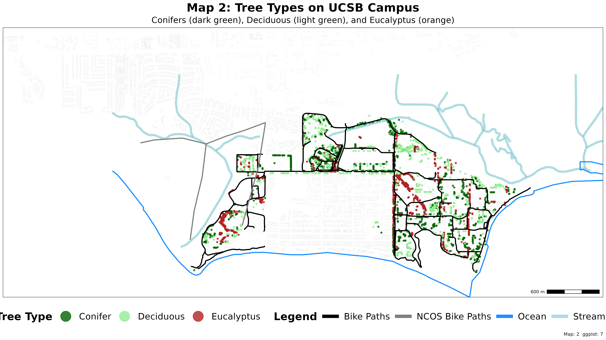
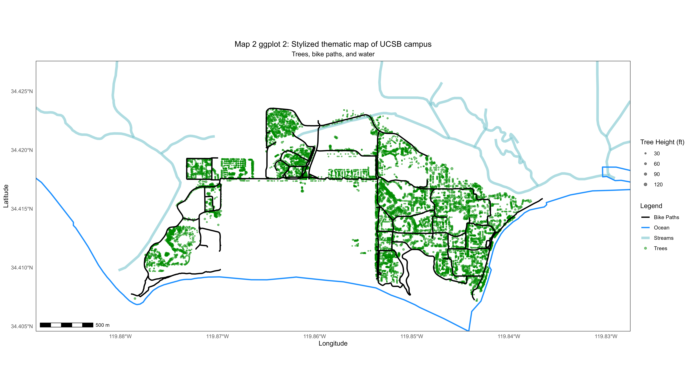

## Rendered Map Plate

{fig-alt="Map 2 Trees and Water" width="100%"}

---

## Technical Summary

* **Objective:** Create a stylized thematic atlas plate visualizing UCSB's extensive tree canopy classified by type (Conifers, Deciduous, Eucalyptus), juxtaposed with campus waterways and active transportation routes.
* **Key Packages:** `sf`, `terra`, `tidyverse`, `scales`, `ggnewscale`, `ggspatial`
* **Data Sources:**
  * Campus Tree Inventory (`source_data/Treekeeper_012116/DTK_012116.shp`)
  * Stream and lagoon network (`source_data/california_streams/California_Streams.shp`)
  * Bike path centerlines (`source_data/icm_bikes/bike_paths/bikelanescollapsedv8.shp`)
  * Coastline boundary vector (`source_data/pacific_ocean-shapefile/3853-s3_2002_s3_reg_pacific_ocean_lines.shp`)
  * Isla Vista building footprints (`source_data/iv_buildings/iv_buildings/CA_Structures_ExportFeatures.shp`)
* **Cartographic Decisions:**
  * Clean presentation without distracting coordinate axis ticks or numbers (`axis.text = element_blank()`, `axis.ticks = element_blank()`).
  * Uncluttered layout without an orienteering compass/north arrow.
  * Prominent, high-visibility legend positioned horizontally along the base of the sheet.
  * Explicit white background in `ggsave` to guarantee crisp rendering across light and dark display modes.

---

## Step-by-Step Cartographic Workflow & Intermediate Outputs

The script `scripts/map_02.r` progresses through data harmonization, spatial filtering/cropping, multi-scale color management (`ggnewscale`), and taxonomic categorization.

### Step 1: Reprojecting Vector Inputs & Spatial Cropping

The raw inputs span 3 different coordinate systems (EPSG 3857, EPSG 2229, EPSG 4326), and the statewide streams dataset covers all of California. The script projects all layers into WGS84 Pseudo-Mercator (`EPSG:3857`) and clips regional layers to the campus study bounds.

```r
# Reproject to common CRS (EPSG:3857 matching trees)
bikes_proj <- project(bikes, trees)
coastline_proj <- project(coastline, trees)

# Crop large regional layers to campus extent
streams_crop <- crop(streams, trees)
coastline_crop <- crop(coastline_proj, trees)
```

### Step 2: Intermediate Plot — Mapping Tree Height Continuous Gradient

Before settling on taxonomic groupings, the first complete visualization mapped tree heights continuously using the viridis color ramp, paired with a spatial scale bar.

```r
# Intermediate: Tree height aesthetic mapping
map2_gg4 <- map2_gg3 +
  annotation_scale(location = "bl", width_hint = 0.1)

ggsave("images/map2_TreeHeight.png", plot = map2_gg4, width = 16, height = 9, bg = "white")
```

{fig-alt="Map 2 Tree Height" width="100%"}

### Step 3: Intermediate Plot — Top 5 Dominant Tree Species

With over 245 distinct tree species recorded across campus, plotting every species created visual noise. The script aggregated the 5 most frequent species (`count(SPP, sort=TRUE) %>% head()`) and lumped the remainder into an `"Other"` category.

```r
# Filter top 5 species and aggregate remainder
top5_species <- trees_filt %>%
  count(SPP, sort = TRUE) %>%
  head() %>%
  pull(SPP)

trees_filt$SPP_grouped <- ifelse(
  trees_filt$SPP %in% top5_species,
  str_to_title(trees_filt$SPP),
  "Other"
)
```

{fig-alt="Map 2 Tree Species" width="100%"}

### Step 4: Final Plate — Broad Structural Typologies & Horizontal Legend

While top species offered taxonomic detail, grouping trees into broader structural typologies (**Conifer**, **Deciduous**, **Eucalyptus**) produced the most cartographically cohesive story:
* **Conifers** (dark green): Pines, cedars, and cypresses along bluffs and campus entries.
* **Deciduous** (light green): Sycamores, oaks, maples, and alders bordering streams and courtyards.
* **Eucalyptus** (firebrick): Historic windbreaks and grove plantings across West Campus and Storke.

Using `ggnewscale::new_scale_color()`, separate legends were declared for linear water/transit networks and tree canopies, ending with a spacious bottom banner layout.

```r
# Categorization by regex keyword matching
trees_filt$Tree_Type <- case_when(
  str_detect(trees_filt$SPP, regex("PINUS|CEDRUS|CUPRESSUS|SEQUOIA|PICEA|ABIES", ignore_case = TRUE)) ~ "Conifer",
  str_detect(trees_filt$SPP, regex("QUERCUS|PLATANUS|ACER|ALNUS|BETULA|FAGUS|SALIX|POPULUS|PRUNUS", ignore_case = TRUE)) ~ "Deciduous",
  str_detect(trees_filt$SPP, regex("EUCALYPTUS", ignore_case = TRUE)) ~ "Eucalyptus",
  TRUE ~ "Other"
)
```

{fig-alt="Map 2 Tree Types" width="100%"}

---

## Full R Script (`scripts/map_02.r`)

```{r}
#| eval: false
#| code: !expr readLines("../scripts/map_02.r")
```
