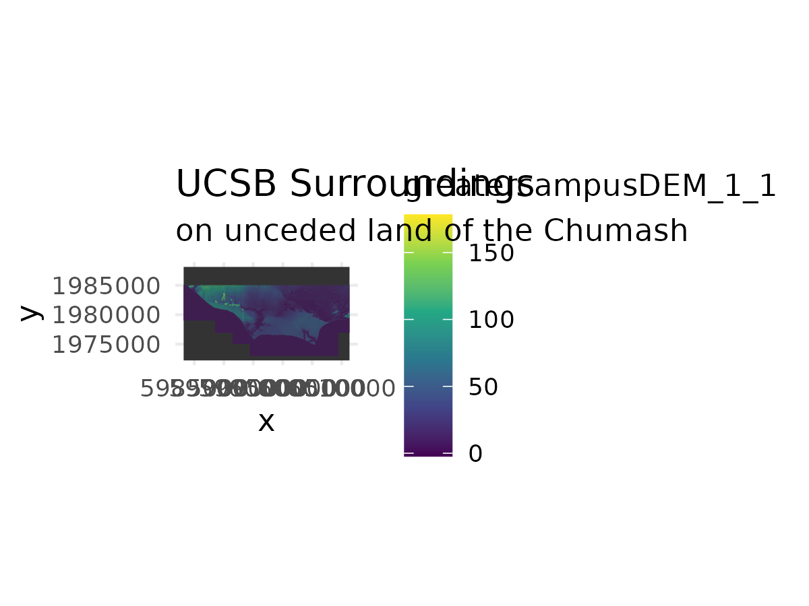

## Rendered Map Plate

{fig-alt="Map 5 Extended Campus" width="85%"}

---

## Technical Summary

* **Objective:** Serve as Inset 3 of the Map 7 tryptic (Zoom 3), transitioning from the regional Bight of California into the immediate coastal context of the UCSB campus and Goleta Slough.
* **Key Packages:** `terra`, `tidyverse`, `tidyterra`, `sf`
* **Data Sources:**
  * Campus DEM (`source_data/campus_DEM.tif`)
  * Campus hillshade (`source_data/campus_hillshade.tif`)
  * Merged campus topo-bathymetry (`output_data/campus_bathotopo.tif`)
* **Styling Decisions:**
  * 4 wide x 3 tall landscape aspect ratio (`width = 4, height = 3`) matching the Map 7 row 1 layout.
  * Axis labels, coordinate text, and tick marks removed.
  * Legend omitted (`guide = "none"`, `legend.position = "none"`).
  * White background set explicitly in `ggsave` for consistent rendering.

---

## Step-by-Step Cartographic Workflow & Intermediate Outputs

The script `scripts/map_05.R` documents the systematic construction of Inset 3 (Zoom 3) across 6 intermediate visual iterations.

### Step 1: Base Raster Layers — DEM & Hillshade Inspection

Before combining layers, the script inspects the raw campus digital elevation model and the multidirectional hillshade raster individually.

::: {.grid}
::: {.g-col-12 .g-col-md-6}
{fig-alt="Map 5.1 Campus Hillshade" width="100%"}
:::
::: {.g-col-12 .g-col-md-6}
{fig-alt="Map 5.2 UCSB DEM" width="100%"}
:::
:::

### Step 2: Intermediate Plot — Layer Blending & Graticule Tests

Next, the hillshade is placed over the DEM using an alpha transparency aesthetic (`scale_alpha(range = c(0.05, 0.5))`), followed by removing axis tick marks to prepare for inset tiling.

::: {.grid}
::: {.g-col-12 .g-col-md-6}
{fig-alt="Map 5.3 Alpha Blending" width="100%"}
:::
::: {.g-col-12 .g-col-md-6}
{fig-alt="Map 5.4 No Axis Labels" width="100%"}
:::
:::

### Step 3: Integrating Offshore Bathymetry & Final Plate

Onshore elevation alone left the Pacific Ocean blank white. By incorporating the pre-computed `campus_bathotopo.tif` surface, coastal bathymetric contours blend into the onshore topography. The title is finalized with an acknowledgment of the Chumash ancestral homelands.

```r
# Incorporating bathotopo surface and final styling
campus_bathotopo <- rast("output_data/campus_bathotopo.tif")
campus_bathotopo_df <- as.data.frame(campus_bathotopo, xy=TRUE)

zoom_3_plot <- ggplot() +
  geom_raster(data = campus_bathotopo_df, aes(x=x, y=y)) +
  geom_raster(data = zoom_3_DEM_df, aes(x=x, y=y, fill=greatercampusDEM_1_1)) +
  scale_fill_viridis_c(guide = "none") +
  geom_raster(data = zoom_3_hillshade_df, aes(x=x, y=y, alpha=hillshade)) +
  scale_alpha(range = c(0.05, 0.5), guide="none") +
  my_theme +
  coord_sf() + 
  ggtitle("UCSB Surroundings", subtitle = "on unceded land of the Chumash")
```

::: {.grid}
::: {.g-col-12 .g-col-md-6}
{fig-alt="Map 5.5 With Subtitle" width="100%"}
:::
::: {.g-col-12 .g-col-md-6}
{fig-alt="Map 5.6 Batho-topo Overlay" width="100%"}
:::
:::

---

## Full R Script (`scripts/map_05.R`)

```{r}
#| eval: false
#| code: !expr readLines("../scripts/map_05.R")
```
