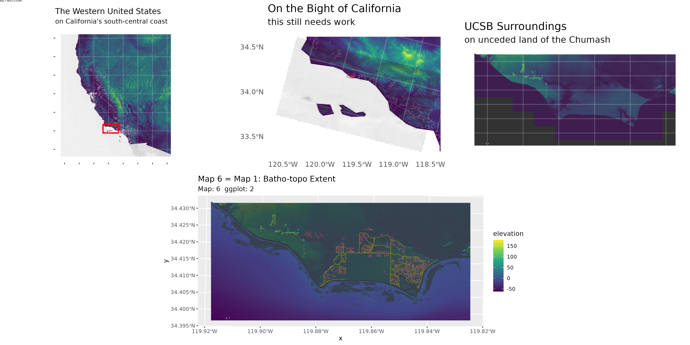
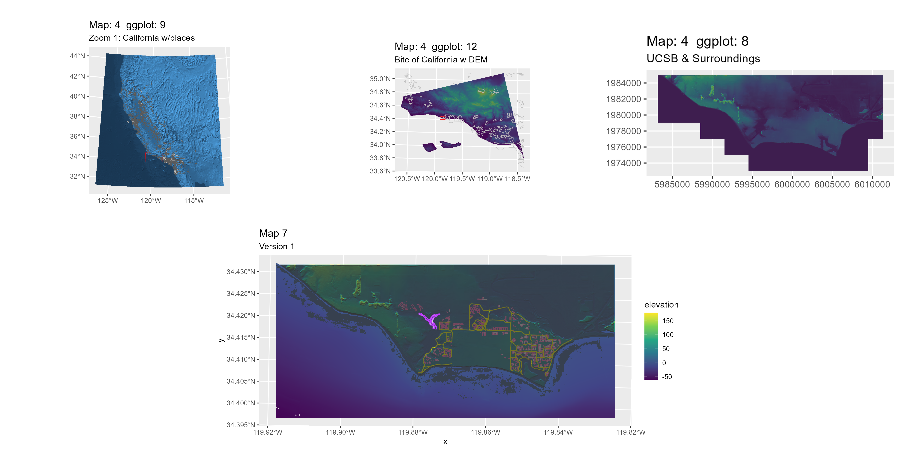
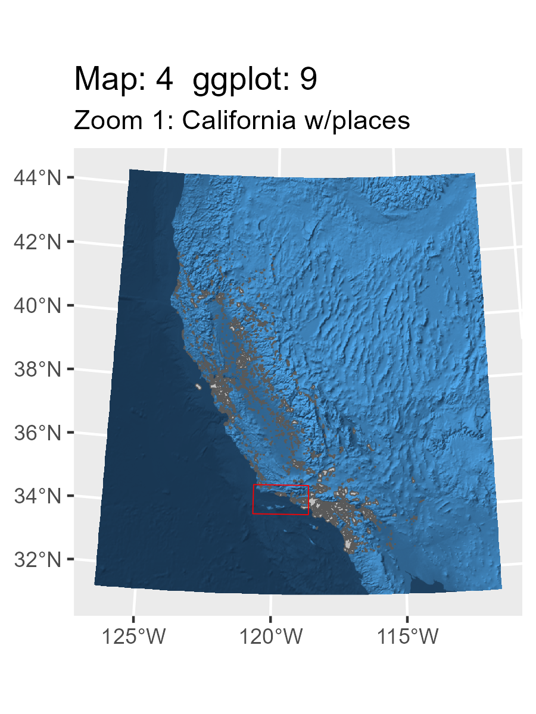
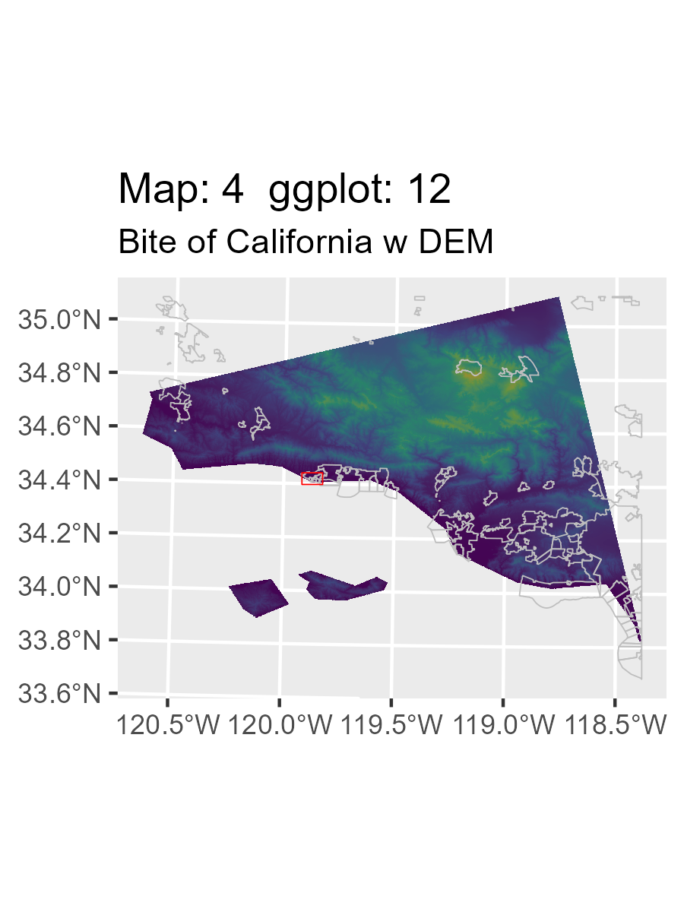
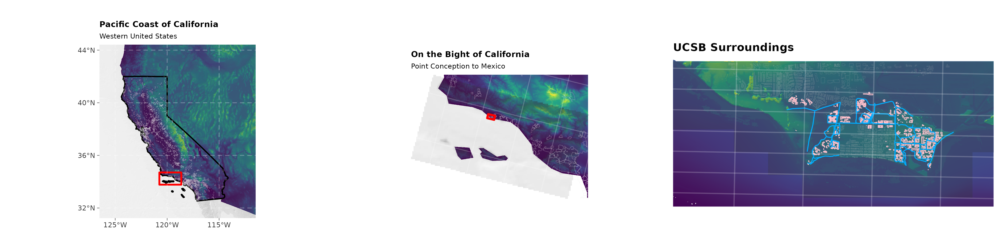

## Rendered Map Plate

{fig-alt="Map 7 Composite Layout" width="100%"}

---

## Technical Summary

* **Objective:** Synthesize individual cartographic components into a publication-ready atlas sheet. The top row forms a three-tier geographic zoom sequence (Western US &rarr; Bight of California &rarr; Extended Campus), anchored below by the panoramic campus base map (Map 6).
* **Key Packages:** `magick`
* **Inputs:**
  * `images/map3.png` (900 x 1200 px, 3x4 in portrait)
  * `images/map4.png` (900 x 1200 px, 3x4 in portrait)
  * `images/map5.png` (1200 x 900 px, 4x3 in landscape)
  * `images/map6.1.png` (3600 x 1200 px, 12x4 in panorama)
* **Outputs:**
  * Top tryptic row: `final_output/map7_row_1.png` (4800 x 1200 px)
  * Complete atlas sheet: `final_output/map_07.png` (4800 x 2400 px)

---

## Step-by-Step Cartographic Workflow & Intermediate Outputs

The script `scripts/map_07.r` demonstrates how programmatic image montage workflows in `magick` can assemble multi-scale atlas plates that exceed standard `ggplot` facet capabilities.

### Step 1: Ingesting Component Map Plates

Four separately compiled graphics are ingested into memory via `image_read()`:

```r
library(magick)

# Read the component plates
map3 <- image_read("images/map3.png")   # Inset 1: Western US (3x4 in)
map4 <- image_read("images/map4.png")   # Inset 2: Bight of California (3x4 in)
map5 <- image_read("images/map5.png")   # Inset 3: Extended Campus (4x3 in)
map6 <- image_read("images/map6.1.png") # Bottom Hero: Panoramic Campus (12x4 in)
```

::: {.grid}
::: {.g-col-12 .g-col-md-4}
{fig-alt="Map 3 Inset" width="100%"}
:::
::: {.g-col-12 .g-col-md-4}
{fig-alt="Map 4 Inset" width="100%"}
:::
::: {.g-col-12 .g-col-md-4}
{fig-alt="Map 5 Inset" width="100%"}
:::
:::

### Step 2: Assembling Row 1 Inset Tryptic

Using `image_montage()`, Maps 3, 4, and 5 are combined horizontally across a `3x1` grid with centered gravity. Each tile cell is assigned `1600x1200px` to maintain consistent vertical alignment across both portrait and landscape inputs.

```r
# Intermediate montage: 3-panel zoom sequence
map7_row1 <- image_montage(
  image = c(map3, map4, map5),
  tile = "3x1",
  geometry = "1600x1200",
  gravity = "center"
)

image_write(map7_row1, "final_output/map7_row_1.png", format = "png")
```

{fig-alt="Map 7 Row 1 Tryptic" width="100%"}

### Step 3: Vertical Stacking & Sheet Annotation

Finally, the top tryptic row (`map7_row1`) and the bottom panoramic base map (`map6`) are stacked vertically across a `1x2` montage grid. The finished plate is stamped with the atlas sheet title using `image_annotate()`.

```r
# Stack row 1 and row 2 into final 2-tier atlas plate
map7 <- image_montage(
  image = c(map7_row1, map6),
  tile = "1x2",
  geometry = "4800x1200"
)

map_7_titled <- image_annotate(
  map7, 
  "Map 7: Where is UCSB?",
  size = 14,
  location = "+0+0"
)

image_write(map_7_titled, "final_output/map_07.png", format = "png")
```

---

## Full R Script (`scripts/map_07.r`)

```{r}
#| eval: false
#| code: !expr readLines("../scripts/map_07.r")
```
