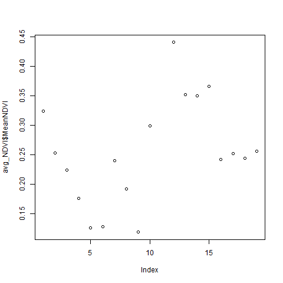

## Rendered Map Plate

{fig-alt="Map 8 PlanetScope Satellite Imagery" width="100%"}

---

## Technical Summary

* **Objective:** Explore multi-band raster manipulation using PlanetScope 4-band and 8-band high-resolution satellite scenes covering UCSB across multiple seasonal collections.
* **Key Packages:** `terra` (pure raster workflow)
* **Techniques Demonstrated:**
  * Multi-band raster subsetting and indexing
  * Natural color RGB compositing (`plotRGB` with linear stretch)
  * False-color Infrared (CIR) compositing highlighting active photosynthetic vegetation
  * Dynamic range scaling and histogram stretching
* **Output:** `final_output/map_08.png` (also archived at `final_output/map8.png`)

---

## Step-by-Step Cartographic Workflow & Intermediate Outputs

The script `scripts/map_08.r` is an all-`terra` workflow exploring multi-spectral remote sensing channels and false-color infrared composites.

### Step 1: Ingesting PlanetScope 8-Band Surface Reflectance

An 8-band PlanetScope AnalyticMS scene (`20230912_..._SR_8b_clip.tif`) is loaded into a `SpatRaster`. The scene features 3-meter pixel resolution and 8 spectral bands: Coastal Blue (1), Blue (2), Green I (3), Green II (4), Yellow (5), Red (6), Red Edge (7), and Near-Infrared / NIR (8).

```r
library(terra)

# Load 8-band surface reflectance cube
planet_scene <- rast("source_data/planet/planet/20232024_UCSB_campus_PlanetScope/PSScene/20230912_175450_00_2439_3B_AnalyticMS_SR_8b_clip.tif")

# Inspect raster metadata
dim(planet_scene) # Rows, columns, and 8 spectral bands
res(planet_scene) # ~3.0 meter ground sample distance
```

### Step 2: Dynamic Range Stretching (`stretch = "hist"` vs `"lin"`)

Raw 16-bit satellite reflectance values cluster in low radiometric values. Passing raw rasters to `plotRGB()` produces near-black outputs. The script applies dynamic range histogram equalization:

```r
# Testing stretch modes
plotRGB(planet_scene, stretch = "lin")
plotRGB(planet_scene, stretch = "hist")
```

### Step 3: Spectral Band Combinations & Quadrant Compositing

By mapping non-visible spectral wavelengths into standard red-green-blue display channels, different physical phenomena emerge:

1. **Natural Color (`r=4, g=3, b=2`):** Green, Blue, and Coastal Blue approximate true human vision.
2. **False-Color Infrared (`r=8, g=3, b=2`):** Maps Near-Infrared (Band 8) into the Red channel. Healthy chlorophyll strongly reflects NIR, causing athletic turf, Goleta Slough wetlands, and irrigated campus landscaping to glow bright crimson.
3. **Yellow-as-Green (`r=7, g=5, b=1`):** Highlights vegetation vigor using the Red Edge band (Band 7).
4. **Pretty High-Contrast (`r=7, g=4, b=1`):** Accentuates marine boundaries, sediment plumes, and urban structures.

```r
# Export 4-quadrant remote sensing comparison plate
png("final_output/map_08.png", width = 1200, height = 1200, res = 150)
par(mfrow = c(2, 2))

# 1. Natural Color
plotRGB(planet_scene, stretch = "hist", r = 4, g = 3, b = 2, main = "Natural Color (RGB)")

# 2. False-Color Infrared (CIR)
plotRGB(planet_scene, stretch = "hist", r = 8, g = 3, b = 2, main = "False-Color Infrared (CIR)")

# 3. Yellow = Green
plotRGB(planet_scene, stretch = "hist", r = 7, g = 5, b = 1, main = "Yellow = Green")

# 4. High-Contrast Composite
plotRGB(planet_scene, stretch = "hist", r = 7, g = 4, b = 1, main = "Pretty (7, 4, 1)")

dev.off()
```

{fig-alt="Map 8 Multi-Spectral Plate" width="70%"}

---

## Full R Script (`scripts/map_08.r`)

```{r}
#| eval: false
#| code: !expr readLines("../scripts/map_08.r")
```
