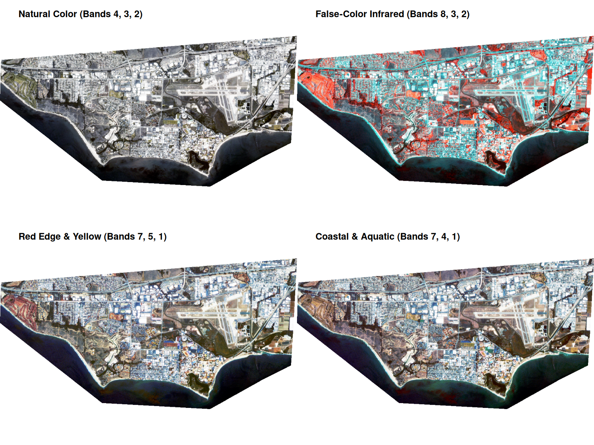

## Rendered Map Plate

{fig-alt="Map 8 PlanetScope Satellite Imagery" width="100%"}

---

## Technical Summary

* **Objective:** Explore multi-band raster manipulation using PlanetScope 4-band and 8-band high-resolution satellite scenes covering UCSB across multiple seasonal collections.
* **Key Packages:** `terra` (pure raster workflow)
* **Techniques Demonstrated:**
  * Multi-band raster subsetting and indexing
  * Natural color RGB compositing (`plotRGB` with linear stretch)
  * False-color Infrared (CIR) compositing highlighting active photosynthetic vegetation
  * Dynamic range scaling and histogram stretching
* **Output:** `final_output/map_08.png`

---

## R Script (`scripts/map_08.r`)

```{r}
#| eval: false
#| code: !expr readLines("../scripts/map_08.r")
```
