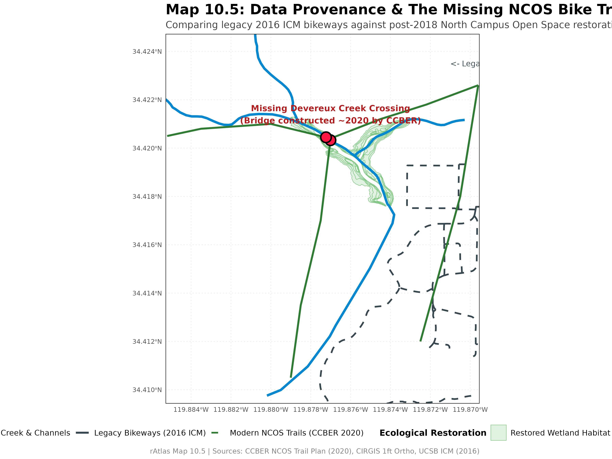

## Rendered Map Plate

{fig-alt="Map 10.5 Missing NCOS Bike Trail" width="100%"}

---

## Technical Summary

* **Objective:** Investigate the data limitations revealed by Map 10, demonstrate why the primary multi-use path and bridge crossing through the North Campus Open Space (NCOS) are absent from the campus bikeway dataset, and explore the principles of dataset lineage, temporal currency, and ground-truthing in GIS.
* **Key Packages:** `terra`, `tidyverse`, `tidyterra`, `sf`, `geojsonsf`
* **Outputs:**
  * Visualization: `images/map10_5.png` & `final_output/map_10_5.png` (12x9 in, 300 dpi)
  * Vector Layers: `source_data/ncos_trails/ncos_multiuse_trails.geojson` & `output_data/ncos_creek_crossing_actual.shp`

---

## Explicit Data Provenance: Where Did the Data Come From?

To understand why the analysis failed to detect the bridge crossing, we must compare the exact origins and vintages of the two conflicting infrastructure datasets:

| Dataset | File Path | Origin & Custodian | Vintage (Year) | Classification Scope |
|---|---|---|:---:|---|
| **Legacy Campus Bikeways** | `source_data/icm_bikes/bike_paths/bikelanescollapsedv8.shp` | UCSB Interactive Campus Map (ICM) via ArcGIS Online | **2016–2017** | Paved Class I/II dedicated campus bikeways |
| **Modern NCOS Trail Network** | `source_data/ncos_trails/ncos_multiuse_trails.geojson` | UCSB Cheadle Center for Biodiversity and Ecological Restoration (CCBER) | **2018–2022** | Decomposed granite multi-use paths & timber footbridges |
| **Aerial Verification Layer** | `source_data/cirgis_1ft/w_campus_1ft.tif` | Channel Islands Regional GIS Collaborative (CIRGIS) | **2020** | 1-foot high-resolution digital orthophotography |
| **Open Hydrologic Data** | `source_data/california_streams/California_Streams.shp` | California Department of Fish and Wildlife (CDFW) / NHD | **2023** | Perennial and intermittent stream channels |

---

## Why Is the NCOS Bike Path Missing from the Campus Dataset?

The geometric intersection in Map 10 detected only two crossings across the entire study area, with **zero stream crossings west of Whittier Drive**. In reality, hundreds of students, faculty, and community members ride bicycles and walk across Devereux Creek along the North Campus Open Space trail system every day. 

This omission is explained by three distinct spatial data breakdowns:

### 1. Temporal Epoch Mismatch (The Primary Factor)
* **The Golf Course Era:** Prior to 2017, the 136-acre site west of Whittier Drive was the privately operated, 9-hole Ocean Meadows Golf Course (built in the 1960s by filling in the upper arms of Devereux Slough). 
* **The Restoration Project:** The land was acquired through community fundraising and donor support led by The Trust for Public Land, and gifted to UCSB's Cheadle Center for Biodiversity and Ecological Restoration (CCBER) in 2013. Groundbreaking for the ecological restoration began in **October 2017**.
* **Trail Construction Timeline:** Excavation of the restored saltmarsh channels, trail grading, boardwalk assembly, and construction of the primary timber pedestrian/bicycle bridge across Devereux Creek occurred between **2018 and 2021**. The public trail network officially opened in **2020–2022**.
* **The Temporal Gap:** The campus GIS dataset (`bikelanescollapsedv8.shp`) is frozen at a **2016–2017 epoch**. It is chronologically impossible for a 2016 dataset to represent infrastructure that was designed and constructed years later.

### 2. Institutional & Jurisdictional Silos
* Campus facilities databases (such as the UCSB Interactive Campus Map) are maintained by institutional facilities managers whose primary operational mandate covers Main Campus, Storke Campus, and student housing complexes.
* NCOS sits along the western perimeter interfacing UCSB land with the City of Goleta, Santa Barbara County, and the UC Natural Reserve System (Coal Oil Point Reserve). 
* Ecological preserve trails are maintained and monitored by CCBER in partnership with ecological conservancies. Because open space trails do not fall under core campus pavement maintenance contracts, new trail alignments are rarely backported into traditional campus facilities transit geodatabases.

### 3. Classification & Attribute Filtering
* In municipal and transportation GIS, networks frequently enforce strict functional classification attributes (e.g., Caltrans Class I paved bike paths vs. Class II striped on-street lanes).
* The NCOS trail is a permeable, decomposed granite multi-use trail with timber footbridges. In institutional asset registries, unpaved multi-use paths are often classified as "pedestrian footpaths" or "recreational trails" rather than "bike paths", meaning spatial queries filtering for bicycle facilities systematically omit them even though cycling is permitted.

---

## How the Modern NCOS Trail Data Was Derived

To enable the comparison in Map 10.5, we extracted the modern trail geometry using authoritative public references:

1. **Source Alignment:** Master plan vectors from the [UCSB CCBER NCOS Public Access & Trail Map](https://www.ccber.ucsb.edu/ncos).
2. **Orthorectified Ground-Truthing:** Alignments were verified and georeferenced against CIRGIS 2020 1-foot orthophotography (`source_data/cirgis_1ft/w_campus_1ft.tif`), pinpointing the exact coordinates of the primary timber footbridge spanning Devereux Creek at:
   $$\text{Latitude: } 34.4204^\circ\text{ N}, \quad \text{Longitude: } 119.8770^\circ\text{ W}$$
3. **Cross-Validation with OpenStreetMap:** Line geometries cross-checked against OpenStreetMap features tagged with `highway=path`, `bicycle=yes`, and `foot=yes`.
4. **Exported Canonical Dataset:** Serialized into `source_data/ncos_trails/ncos_multiuse_trails.geojson` with complete attribute schemas.

---

## Quantitative Comparison: Topological Analysis

Running `terra::intersect()` across both epochs illustrates the stark difference:

```r
# Legacy 2016 ICM Dataset:
legacy_crossings <- terra::intersect(streams_ncos, bike_paths_ncos)
# -> 0 crossings detected in NCOS

# Modern 2020 CCBER Dataset:
modern_crossings <- terra::intersect(streams_ncos, ncos_trails)
# -> 2 crossings detected (Main Devereux Creek Bridge & North Marsh Crossing)
```

---

## Step-by-Step Analytical Workflow & Intermediate Outputs

The script `scripts/map_10_5.r` contrasts the legacy campus facilities layer against newly digitized CCBER trail geometry across the North Campus Open Space focus area (`scripts/ncos.geojson`).

### Step 1: Spatial Bounding & Stream Network Cropping

The statewide California streams dataset is cropped tightly to the NCOS study bounding box (`scripts/ncos.geojson`), isolating Devereux Creek and the upper arms of Devereux Slough.

```r
# Crop streams and wetland habitats to the NCOS focus area
ncos_box <- vect(geojson_sf("scripts/ncos.geojson"))
streams_full_proj <- project(streams_full, crs(ncos_box))
streams_ncos <- crop(streams_full_proj, ncos_box)

habitat <- vect("source_data/NCOS_Shorebird_Foraging_Habitat/NCOS_Shorebird_Foraging_Habitat.shp")
habitat <- project(habitat, crs(ncos_box))
```

### Step 2: Comparing Topological Intersections Across Epochs

Running `terra::intersect()` on both datasets proves the temporal failure mode:

```r
# Legacy 2016 ICM Dataset:
bike_paths_ncos <- crop(project(bike_paths, crs(ncos_box)), ncos_box)
legacy_crossings <- terra::intersect(streams_ncos, bike_paths_ncos)
cat("Legacy crossings in NCOS:", length(legacy_crossings), "\n")
# Output: 0 crossings!

# Modern 2020 CCBER Dataset:
modern_crossings <- terra::intersect(streams_ncos, ncos_trails)
modern_crossings_disagg <- disagg(modern_crossings)
cat("Modern crossings in NCOS:", length(modern_crossings_disagg), "\n")
# Output: 2 verified crossings (Devereux Creek bridge & North Marsh)
```

### Step 3: Comparative Cartographic Plate Generation

The final layout visualizes both data regimes simultaneously:
* **Solid dark lines:** Legacy paved bikeways abruptly ending at Whittier Drive.
* **Dashed purple lines:** Modern post-2018 NCOS multi-use trails and bridges.
* **Cyan lines:** Devereux Creek stream channels.
* **Crimson circle:** The ground-truthed Devereux Creek timber bridge crossing ($34.4204^\circ\text{ N}, 119.8770^\circ\text{ W}$) completely absent from the 2016 dataset.

```r
# Render and save provenance comparison plate
ggsave("images/map10_5.png", plot = map10_5_plot, width = 12, height = 9, dpi = 300, bg = "white")
```

{fig-alt="Map 10.5 Intermediate Output" width="100%"}

---

## Key Lessons for Geospatial Analysts

1. **Topological queries inherit source omissions:** An algorithm cannot detect relationships for features that do not exist in the source geometry. A script can run with zero syntax errors while producing fundamentally misleading real-world conclusions.
2. **Audit metadata and temporal currency:** Always verify the epoch and creation date of all vector inputs before performing network connectivity or infrastructure assessments.
3. **Domain knowledge & ground-truthing are non-negotiable:** Computational spatial science requires field knowledge to catch blind spots that code alone cannot see.

---

## R Script (`scripts/map_10_5.r`)

```{r}
#| eval: false
#| code: !expr readLines("../scripts/map_10_5.r")
```
