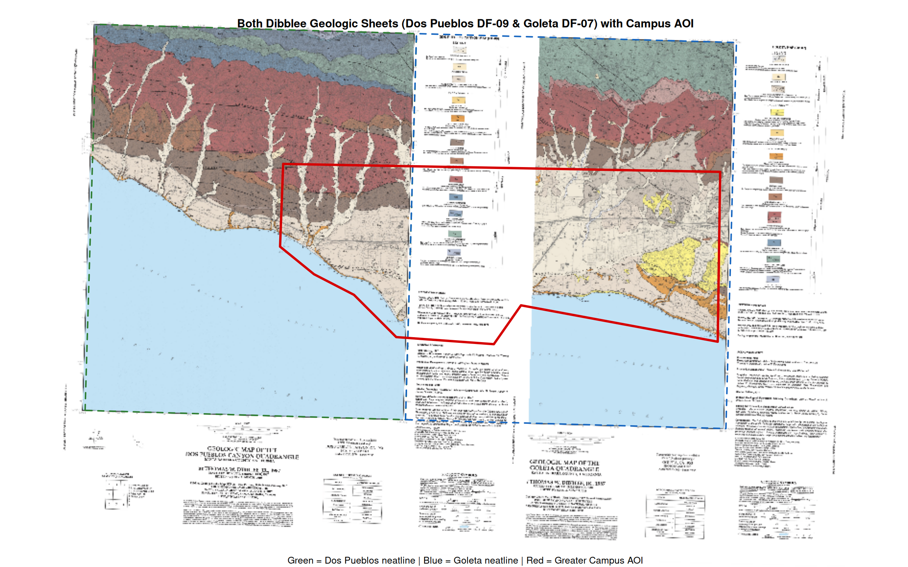
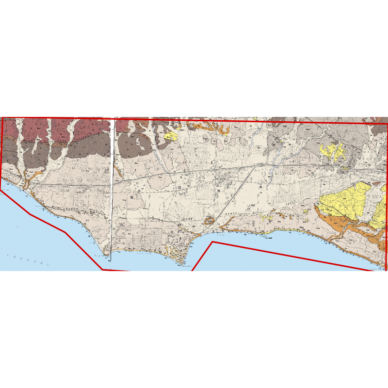

## Rendered Map Plates

### Spliced Campus Geological Surface (Campus AOI)
The finished atlas plate below shows the **seamlessly spliced geological mosaic** across the entire Greater UCSB Campus study area. The western section (North Campus Open Space, Devereux Slough, Coal Oil Point Reserve, and Ellwood) is sourced from the **Dos Pueblos Canyon** quadrangle, while the eastern section (Main Campus, Storke Campus, Goleta Slough, and Airport) is sourced from the **Goleta** quadrangle.

{fig-alt="Map 11 Spliced Dibblee Map" width="100%"}

---

### Intermediate Diagnostic: Full Extent of Both Sheets with Overlaid AOI
To visualize the spatial relationship between the two historic paper sheets and the campus study area, both uncropped, rectified sheets are displayed side by side:

{fig-alt="Both Dibblee Sheets with AOI" width="100%"}

::: {.callout-note}
### Spatial Splicing & The Dividing Meridian
* **Green dashed neatline:** Dos Pueblos Canyon 7.5' boundary ($-120^\circ 00' 00''$ to $-119^\circ 52' 30''\text{ W}$).
* **Blue dashed neatline:** Goleta 7.5' boundary ($-119^\circ 52' 30''$ to $-119^\circ 45' 00''\text{ W}$).
* **Red boundary:** Greater UCSB Campus AOI ($-119^\circ 55' 33''$ to $-119^\circ 45' 15''\text{ W}$).

The campus study area sits directly straddling the shared $119^\circ 52' 30''\text{ W}$ dividing meridian. By trimming the paper collars to the neatline coordinates and merging them with `terra::merge()`, the two independent map sheets are spliced into a continuous geological continuum without white border artifacts.

An intermediate multi-sheet GeoTIFF is output to:  
`output_data/dibblee_both_tiffs_full_extent_with_aoi.tif` (107 MB).
:::

---

### Standalone AOI Clip
{fig-alt="Dibblee AOI Map" width="75%"}

---

## Technical Summary

* **Objective:** Ingest two adjacent historic Dibblee geologic quadrangle sheets, rectify rotated affine grids into standard orthogonal space with `terra::rectify()`, trim paper collar margins to 7.5' neatlines, splice the sheets into a continuous mosaic using `terra::merge()`, and clip the geological data to the Greater UCSB study area.
* **Key Packages:** `terra`
* **Input Layers:**
  * **Western Sheet:** Dos Pueblos Canyon 7.5' Geologic Quadrangle (`source_data/09gDosPueblos/DB0009.tif`)
  * **Eastern Sheet:** Goleta 7.5' Geologic Quadrangle (`source_data/07gGoleta/DB0007.tif`)
  * **Campus Study Area:** Greater UCSB Campus AOI (`source_data/greater_UCSB-campus-aoi.geojson`)
* **Generated Outputs:**
  * **Intermediate Full-Extent GeoTIFF:** `output_data/dibblee_both_tiffs_full_extent_with_aoi.tif`
  * **Diagnostic Overview Plate:** `images/map11_both_tiffs_full_extent_aoi.png` & `final_output/map11_both_tiffs_full_extent_aoi.png`
  * **Final Spliced Campus Plate:** `images/map11.png` & `final_output/map_11.png`
  * **Standalone Square Clip:** `final_output/dibble_aoi.png`

---

## Cartographic Workflow

1. **Affine Rectification:** Historical scanned paper maps possess non-orthogonal rotation and scanner distortion. Both `DB0007.tif` and `DB0009.tif` are rectified using bilinear interpolation into orthogonal coordinates (`NAD27 / UTM zone 11N`).
2. **Neatline Collar Trimming:** Paper margins contain bibliographic text, titles, and legends that would obscure the adjacent map if merged directly. Each raster is trimmed to its official 7.5-minute neatline:
   * **Dos Pueblos Canyon:** $-120.000^\circ$ to $-119.875^\circ\text{ W}$, $34.375^\circ$ to $34.500^\circ\text{ N}$
   * **Goleta:** $-119.875^\circ$ to $-119.750^\circ\text{ W}$, $34.375^\circ$ to $34.500^\circ\text{ N}$
3. **Mosaicking / Splicing:** The trimmed quadrangles are joined along the $-119.875^\circ$ meridian using `terra::merge()`.
4. **AOI Extraction:** The spliced mosaic is cropped to `greater_UCSB-campus-aoi.geojson` and rendered with `plotRGB()` at publication resolution.

---

## R Script (`scripts/map_11.r`)

```{r}
#| eval: false
#| code: !expr readLines("../scripts/map_11.r")
```
