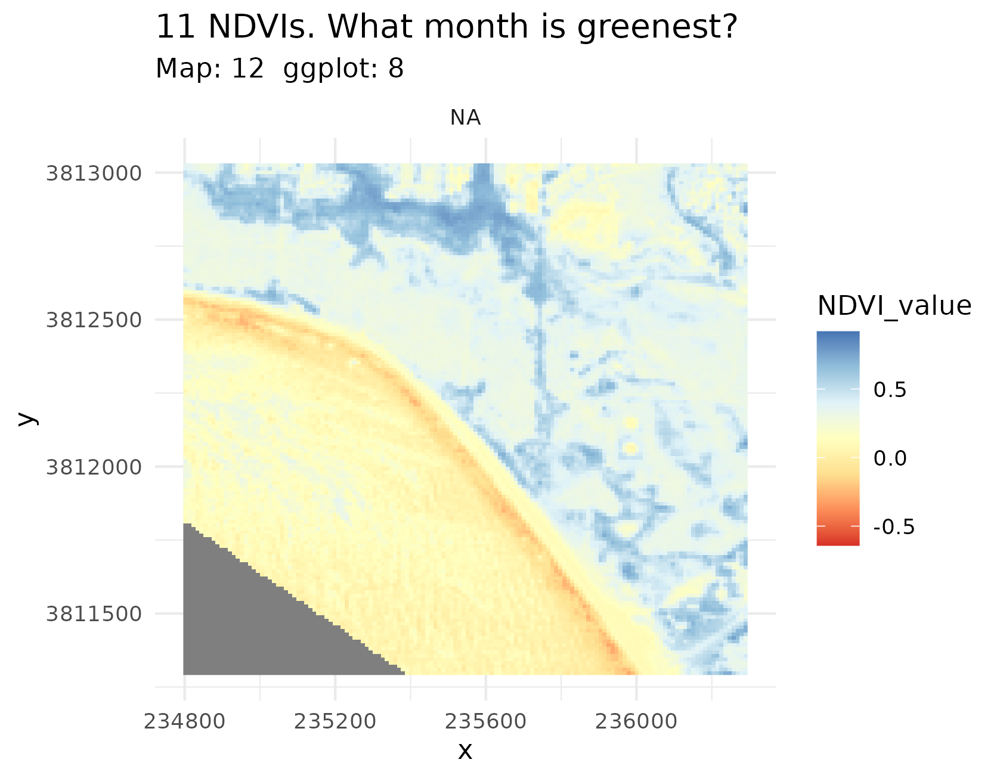
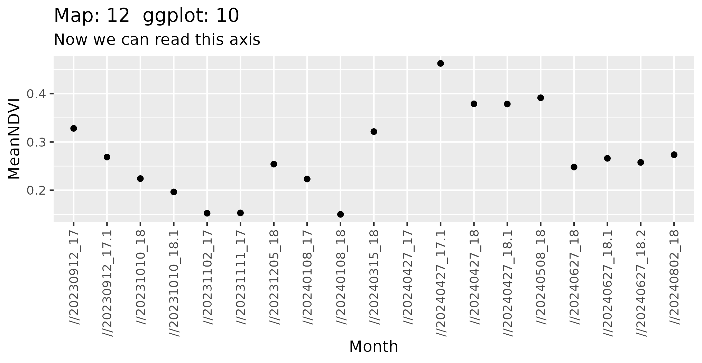

## Rendered Map Plates

### Monthly NDVI Raster Stack
{fig-alt="Map 12 NDVI Raster Stack" width="100%"}

### Vegetation Phenology Curve
{fig-alt="Plot 12 Mean NDVI" width="85%"}

---

## Technical Summary

* **Objective:** Calculate monthly Normalized Difference Vegetation Index (NDVI) rasters across an entire annual cycle using PlanetScope satellite collections to answer the question: *What month is UCSB greenest?*
* **Formula:**
  $$\text{NDVI} = \frac{\text{NIR} - \text{Red}}{\text{NIR} + \text{Red}} = \frac{\text{Band 8} - \text{Band 6}}{\text{Band 8} + \text{Band 6}}$$
* **Key Packages:** `terra`, `ggplot2`, `dplyr`, `tidyr`, `lubridate`, `scales`
* **Data Sources:**
  * Monthly PlanetScope AnalyticMS scenes (`output_data/ndvi/*.tif`)
  * Campus boundary polygon
* **Outputs:**
  * Faceted multi-panel map plate: `final_output/map_12.png`
  * Time-series trajectory plot: `final_output/plot_12.png`

---

## R Script (`scripts/map_12.r`)

```{r}
#| eval: false
#| code: !expr readLines("../scripts/map_12.r")
```
