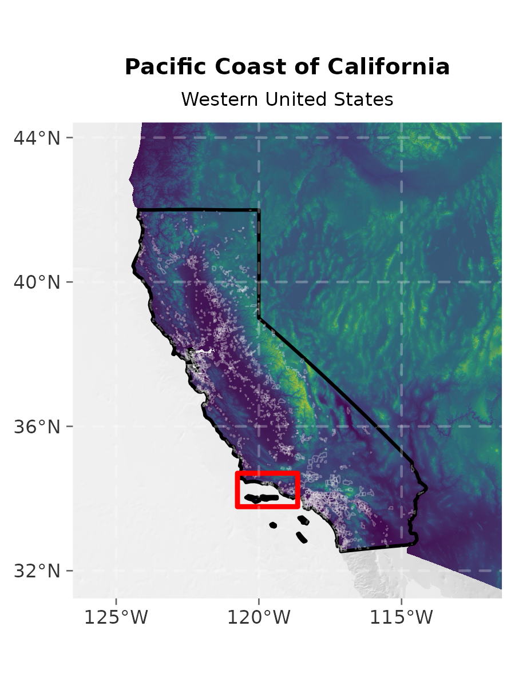
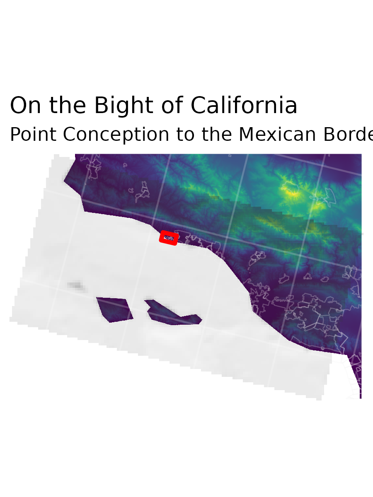

::: {.lead}
Tracking the visual outputs, cartographic decisions, and developmental milestones of the UCSB R-Atlas.
:::

## Aspect Ratio Guidelines
All outputs from atlas map scripts are standardized to a **3 tall x 4 wide** (or **4 tall x 3 wide**) aspect ratio for consistent framing, except where multi-panel compositions require custom dimensions (such as Map 7).

---

## Plate Milestones

### Map 1: Campus Overview
{fig-alt="Map 1 Draft" width="90%"}

### Map 2: Trees and Torches
{fig-alt="Map 2 Trees" width="90%"}

### Map 7: Atlas Page Insets (Maps 3, 4, 5, 6)
The tryptic sequence zooms progressively from the Western United States into the Santa Barbara Channel and Campus:

::: {layout-ncol=3}

:::

Combined full-page layout:

{fig-alt="Map 7 composite" width="100%"}

### Map 8: PlanetScope Satellite Imagery
{fig-alt="Map 8 PlanetScope" width="90%"}

### Map 11: Dibblee Geologic Map
{fig-alt="Map 11 Dibblee Map" width="90%"}

### Map 12: 12-Month NDVI Phenology Stack
{fig-alt="Map 12 NDVI Stack" width="90%"}

{fig-alt="Plot 12 NDVI Curve" width="75%"}
